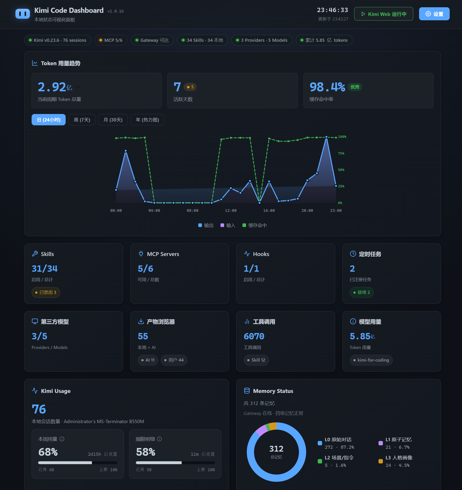
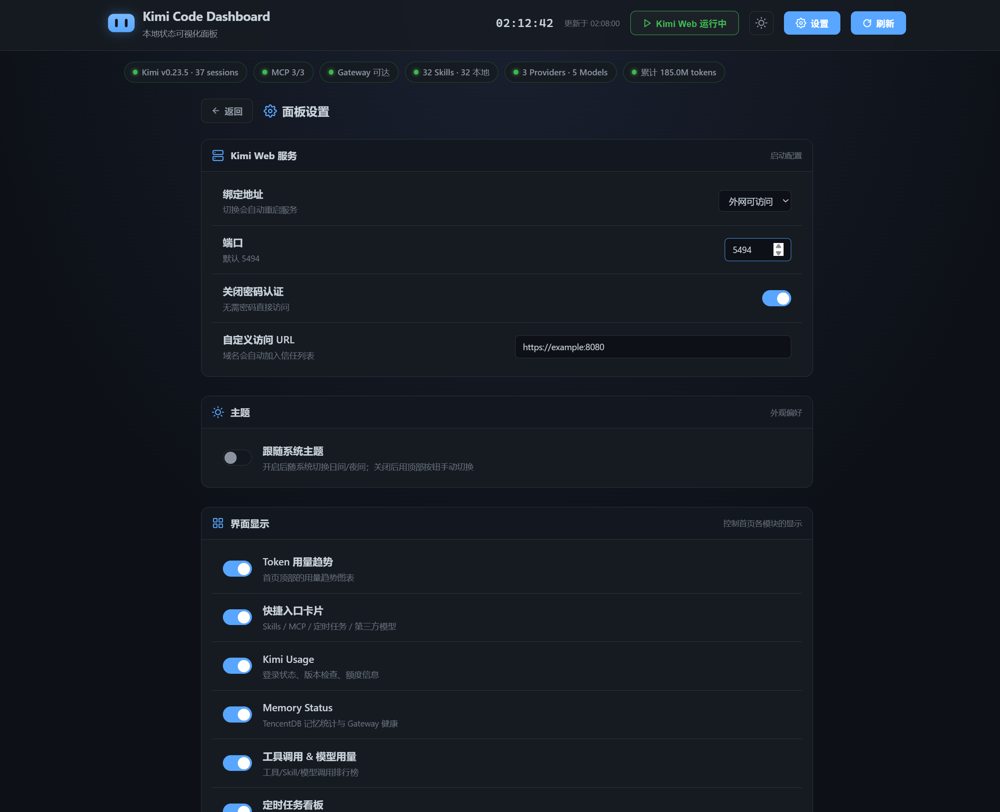

# Kimi Code Dashboard

Kimi Code CLI 的本地可视化面板，展示 Skill、MCP、记忆状态、Kimi 用量概览、模型分布和定时任务，并提供 Kimi Web 服务的可视化启动配置。

> 💡 **推荐搭配**：如需长期向量记忆，建议同时安装 [kimi-code-memory-mcp](https://github.com/perinchiang/kimi-code-memory-mcp)。



## 功能

### 数据可视化

- **Token 用量趋势**：日 / 周 / 月 / 年（热力图）四档粒度，支持悬停查看详情
- **Skills 详情**：读取本地 `~/.agents/skills/`，展示已安装 Skills 与描述
- **MCP Servers**：读取 `~/.kimi-code/mcp.json`，检测各 server 运行状态与 TencentDB Gateway 健康
- **Memory Status**：调用本地 TencentDB Gateway，以甜甜圈图展示 L0–L3 四级记忆分布（需配合 [kimi-code-memory-mcp](https://github.com/perinchiang/kimi-code-memory-mcp)）
- **Kimi Usage**：本地 sessions 统计、登录状态、版本检查与一键更新
- **额度查询**：可选接入 API Key，展示 5 小时 / 7 天窗口的 Token 额度与重置时间
- **工具 & 模型用量排行榜**：从 `wire.jsonl` 解析 `tool.call` / `usage.record` 事件，统计调用次数与各模型 Token 占比
- **定时任务看板**：聚合多个来源（Kimi Code / wiki-sync 等）的定时任务状态

### 产物与配置管理

- **产物浏览器**（`#/artifacts`）：浏览 `~/.kimi-code/files/` 与会话 `blobs/`，支持缩略图网格、搜索、筛选、详情弹窗，可选上传到图床获取外链
- **Hooks 管理**（`#/hooks`）：可视化编辑 `config.toml` 的 `hooks` / `disabled_hooks` 数组，支持 CRUD、启用/禁用、中文描述
- **第三方模型配置**（`#/models`）：管理 `config.toml` 的 `[providers]` 与 `[models]`，支持探测模型列表、预设、能力推断
- **图床配置**（设置页）：配置 R2 / S3 / MinIO / OSS / COS 凭证，写入 `[image_bed]` 段，支持测试连接（需安装可选依赖 `boto3`）

### Kimi Web 服务配置

面板右上角「启动 Kimi Web」按钮可直接拉起本地 Kimi Web 服务，所有启动参数都可在「面板设置」页中可视化配置：



- **绑定地址**：`127.0.0.1`（仅本机）或 `0.0.0.0`（外网可访问），切换时自动重启服务
- **端口**：默认 5494，可自定义
- **密码认证**：开启时无需密码直接访问；关闭时自动从进程 stdout 捕获 bearer token 并拼接到访问 URL
- **自定义访问 URL**：外网模式下可填入一个或多个反代域名，每个域名都会自动提取主机名加入 `--allowed-host` 信任列表，支持 SakuraFrp、Cloudflare Tunnel 等多域名同时访问
- **主题切换**：跟随系统日间 / 夜间主题，或手动切换 dark / light
- **开机自启**：Dashboard 自身支持 normal（Startup folder）/ elevated（Task Scheduler + UAC）/ off 三种模式；Kimi Code 自身支持 macOS launchd / Windows Startup folder
- **默认权限模式**：读写 `config.toml` 的 `default_permission_mode`（manual / auto / yolo）

启动后按钮会变成「打开 Kimi Web」，点击直接跳转到对应 URL（需要认证时附带 token）。

## 启动

```bash
cd ~/.kimi-code/dashboard

# 安装依赖（首次使用）
.venv/Scripts/python.exe -m pip install -r requirements.txt

# Windows
.venv/Scripts/python.exe app.py

# macOS / Linux
.venv/bin/python app.py
```

然后浏览器打开：http://127.0.0.1:8080

### 控制台启动菜单

如果 PowerShell Profile 中配置了 `kimi dashboard` 包装函数，输入该命令会弹出数字菜单（Windows）：

- **macOS / Linux**：在 `~/.zshrc` 或 `~/.bashrc` 里加一个别名即可：
  ```bash
  alias kimi-dashboard='cd ~/.kimi-code/dashboard && ./.venv/bin/python launch_menu.py'
  ```
  然后输入 `kimi-dashboard` 使用菜单。

```text
===== Kimi Code 启动菜单 =====
1. 启动 Dashboard
2. 启动本地 Kimi Code Web
3. 启动外网访问 Kimi Code Web
4. 停止 Kimi Code Web（kimi server kill）
5. 更新 Kimi Code
6. 更新 Dashboard
0. 退出
==============================
```

- 选项 1：后台启动 Dashboard 并自动打开浏览器。
- 选项 2：在本机 `127.0.0.1:5494` 启动 Kimi Code Web（无密码）。
- 选项 3：读取 `start-kimi-web.vbs` 中保存的命令，启动外网访问模式。
- 选项 4：执行 `kimi server kill` 停止所有 Kimi Code Web 进程。
- 选项 5：执行 `kimi upgrade` 更新 Kimi Code CLI。
- 选项 6：在 Dashboard 目录执行 `git pull origin master` 更新面板代码。

也可以直接传入选项数字跳过菜单，例如 `kimi dashboard 2`。

> **跨平台支持**：
> - **全平台可用**：数据可视化、产物与配置管理、Kimi Web 服务配置、主题切换、版本检查与一键更新、手动安装、开机自启（Windows Startup/Task Scheduler、macOS launchd）
> - **仅 Windows**：定时任务看板（依赖 Task Scheduler，macOS/Linux 暂不支持）
> - **Linux 限制**：开机自启暂不支持（macOS 已支持 launchd）
> - 设备型号检测：Windows 用 `Get-CimInstance`（兼容 Win11 24H2+），macOS 用 `sysctl`/`system_profiler`，Linux 读 `/sys/class/dmi/id/product_name`

> **schedule 字段格式**：`每日 HH:MM` / `每周X HH:MM` / `每月D日 HH:MM`（X 为 日 / 一 / 二 / ... / 六，多个用 `、` 分隔，如 `每周一、三、五 09:00`）。`scriptsDir` 支持绝对路径与 `~` 展开。

## 项目结构

```
dashboard/
├── app.py              # 入口：创建 Flask app，注册蓝图
├── config.py           # 路径、常量、日志配置
├── launch_menu.py      # 控制台启动菜单（数字选项）
├── requirements.txt    # Python 依赖清单
├── .env                # API Key（不提交 git）
├── .gitignore
├── tasks.json          # 定时任务配置
├── services/
│   ├── helpers.py      # JSON/HTTP/TCP/YAML 工具函数 + PowerShell 转义
│   ├── wire_parser.py  # 合并 wire.jsonl 解析（单次遍历+缓存+模型统计）
│   └── r2_uploader.py  # S3/R2/MinIO/OSS/COS 统一上传
├── routes/
│   ├── skills.py       # /api/skills
│   ├── mcp.py          # /api/mcp
│   ├── memory.py       # /api/memory
│   ├── kimi.py         # /api/kimi, /api/kimi-trends, /api/kimi-quota,
│   │                   #   /api/kimi-update*, /api/tool-usage, /api/model-usage
│   ├── tasks.py        # /api/tasks, /api/tasks/<id>/run (POST), /api/tasks/<id>/log
│   ├── hooks.py        # /api/hooks — Hooks CRUD
│   ├── model_config.py # /api/model-config — 第三方模型配置
│   ├── image_bed.py    # /api/image-bed — 图床凭证配置
│   ├── artifacts.py    # /api/artifacts — 产物浏览与上传
│   └── system.py       # /api/kimi-web-status, /api/launch-kimi-web (POST), /
├── skills/             # Dashboard 自带 Skill（dashboard-init、kimi-hooks）
├── static/
│   ├── css/style.css   # 样式（从 HTML 分离）
│   └── js/
│       ├── charts.js   # SVG 图表渲染（折线图/热力图/甜甜圈/模型条形图）
│       └── app.js      # 主逻辑（数据加载、路由、事件、设置）
└── templates/
    └── index.html      # 纯 HTML 结构
```

## 安全设计

- 所有状态变更接口（启动 Kimi Web、触发任务、一键更新）均使用 **POST** 方法
- PowerShell 命令中的任务名通过 `ps_escape_single_quote()` 转义，防止注入
- Kimi Web 默认绑定 `127.0.0.1`（非 `0.0.0.0`），仅本机可访问
- `.env` 在 `.gitignore` 中，不会被提交

## 性能优化

- wire.jsonl 解析合并为单次遍历，同时提取 usage 记录、工具调用、模型统计
- 趋势数据、工具用量、模型用量共享 60s TTL 缓存
- 日志写入 `dashboard.log`，不再静默吞掉异常

## 数据说明

- **Skills**：读取 `~/.agents/.skill-lock.json` 与本地 `~/.agents/skills/*/SKILL.md`
- **MCP**：读取 `~/.kimi-code/mcp.json`，并检测 TencentDB Gateway 健康状态
- **Memory**：直接调用本地 TencentDB Gateway（`http://127.0.0.1:8420`）
- **Kimi Usage**：读取本地日志、统计 sessions、检测登录状态
- **Token Trends**：解析 `~/.kimi-code/sessions/*/agents/*/wire.jsonl` 中的 `usage.record` 事件
- **Tool Usage**：解析同一文件中的 `tool.call` 事件
- **Model Usage**：从 `usage.record` 事件的 `model` 字段统计各模型的 token 占比
- **产物浏览器**：读取 `~/.kimi-code/files/index.json` 与 `~/.kimi-code/sessions/*/agents/*/blobs/`
- **图床缓存**：上传记录写入 `~/.kimi-code/dashboard/image_upload_cache.json`
- **Hooks / 模型配置 / 默认权限模式**：读写 `~/.kimi-code/config.toml`

## 可选：查询 Kimi Code 额度

在 [Kimi Code Console](https://www.kimi.com/code/console?from=kfc_overview_topbar) 创建 API Key，然后在「第三方模型配置」页（`#/models`）添加 Kimi provider 并填入 API Key（推荐），或在本项目 `.env` 写入：

```bash
KIMI_API_KEY=your-api-key
```

重启面板即可看到 5 小时窗口与 7 天窗口额度。
