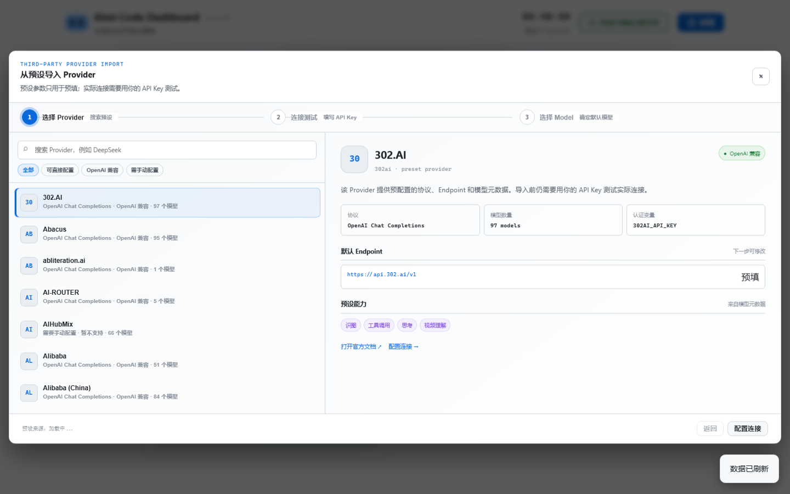
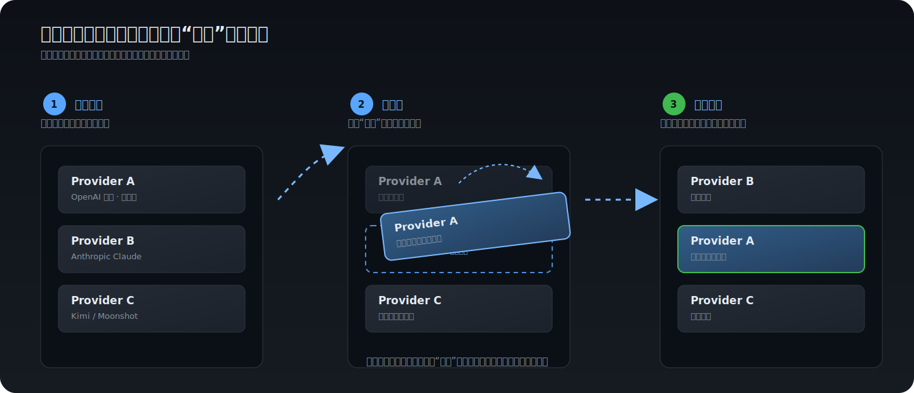

# Kimi Code Dashboard

Kimi Code CLI 的本地可视化控制面板，集中管理 Skill、MCP、会话、记忆、模型 Provider、Kimi 用量、定时任务和 Kimi Web 服务配置。

> 当前版本：**v1.0.18** · 如需长期向量记忆，建议同时安装 [kimi-code-memory-mcp](https://github.com/perinchiang/kimi-code-memory-mcp)。


## v1.0.18 更新

- **本地会话管理**：新增活跃 / 已归档 / 全部筛选、搜索、详情、恢复归档会话和 AI 标题生成。
- **自动会话标题**：新会话首轮回答完成后可自动命名，并按同一会话的对话轮数周期刷新；支持单独选择标题模型。
- **Provider 预设导入**：从 Kimi Provider Catalog / models.dev 搜索预设，完成连接测试后只导入勾选的 Model。
- **Provider / Model 排序**：配置卡片支持整卡拖拽，顺序直接写回 `config.toml`。
- **Memory L0 分页**：直接读取本地 SQLite 获取精确总数，支持稳定游标分页和服务端搜索。
- **设置页重构**：新增分区导航、滚动同步、统一按钮和数字输入样式，并提供本机 / 外网启动命令预览。

## 功能

### 数据可视化

- **Token 用量趋势**：日 / 周 / 月 / 年（热力图）四档粒度，支持悬停查看详情
- **Skills 详情**：读取本地 `~/.agents/skills/`，展示已安装 Skills 与描述
- **MCP Servers**：读取 `~/.kimi-code/mcp.json`，检测各 server 运行状态与 TencentDB Gateway 健康
- **Memory Status**：以甜甜圈图展示 L0–L3 四级记忆分布；L0 使用本地 SQLite 精确计数并按游标加载更早记录（需配合 [kimi-code-memory-mcp](https://github.com/perinchiang/kimi-code-memory-mcp)）
- **Kimi Usage**：本地 sessions 统计、登录状态、版本检查与一键更新
- **额度查询**：可选接入 API Key，展示 5 小时 / 7 天窗口的 Token 额度与重置时间
- **工具 & 模型用量排行榜**：从 `wire.jsonl` 解析 `tool.call` / `usage.record` 事件，统计调用次数与各模型 Token 占比
- **定时任务看板**：聚合多个来源（Kimi Code / wiki-sync 等）的定时任务状态

### 会话与标题管理

- **本地会话列表**（`#/sessions`）：按活跃、已归档或全部会话筛选，支持搜索、分页加载和详情查看
- **恢复会话**：直接恢复 Kimi Code 已归档会话，不改写会话正文
- **AI 重命名**：根据会话摘要或最近消息生成简短标题，手动标题会受到保护，不会被自动任务覆盖
- **自动标题**：默认在新会话首轮回答完成后生成；可设置同一会话每隔多少轮对话刷新，`0` 表示只生成首轮标题
- **标题模型**：默认跟随 Kimi 当前默认模型，也可以选择已配置的 Provider / Model

### 产物与配置管理

- **产物浏览器**（`#/artifacts`）：浏览 `~/.kimi-code/files/` 与会话 `blobs/`，支持缩略图网格、搜索、筛选、详情弹窗，可选上传到图床获取外链
- **Hooks 管理**（`#/hooks`）：可视化编辑 `config.toml` 的 `hooks` / `disabled_hooks` 数组，支持 CRUD、启用/禁用、中文描述
- **第三方模型配置**（`#/models`）：管理 `config.toml` 的 `[providers]` 与 `[models]`，支持模型探测、能力推断和 Provider / Model 整卡拖拽排序
- **Provider 预设向导**：读取 Kimi Provider Catalog，失败时回退到 models.dev；按“选择 Provider → 测试连接 → 选择 Model”三步导入
- **安全导入**：API Key 仅用于连接测试与最终写入，不在接口响应中回显；只导入用户明确勾选的 Model
- **图床配置**（设置页）：配置 R2 / S3 / MinIO / OSS / COS 凭证，写入 `[image_bed]` 段，支持测试连接（需安装可选依赖 `boto3`）





### Kimi Web 服务配置

面板右上角「启动 Kimi Web」按钮可直接拉起本地 Kimi Web 服务，所有启动参数都可在「面板设置」页中可视化配置：

- **绑定地址**：`127.0.0.1`（仅本机）或 `0.0.0.0`（外网可访问），切换时自动重启服务
- **端口**：默认 5494，可自定义；数字输入框会校验 `1–65535`
- **密码认证**：开启时无需密码直接访问；关闭时自动从进程 stdout 捕获 bearer token 并拼接到访问 URL
- **自定义访问 URL**：外网模式下可填入一个或多个反代域名，每个域名都会自动提取主机名加入 `--allowed-host` 信任列表，支持 SakuraFrp、Cloudflare Tunnel 等多域名同时访问
- **启动命令预览**：根据当前设置生成本机 / 外网两套可复制命令，但不会启动服务或改写配置
- **设置分区导航**：左侧快速跳转会随右侧滚动同步，高频设置使用统一的分段按钮和开关样式
- **主题切换**：跟随系统日间 / 夜间主题，或手动切换 dark / light
- **开机自启**：Dashboard 自身支持 normal（Startup folder）/ elevated（Task Scheduler + UAC）/ off 三种模式；Kimi Code 自身支持 macOS launchd / Windows Startup folder
- **默认权限模式**：读写 `config.toml` 的 `default_permission_mode`（manual / auto / yolo）

启动后按钮会变成「打开 Kimi Web」，点击直接跳转到对应 URL（需要认证时附带 token）。

## 启动

### 一键安装（推荐）

```bash
# Windows（PowerShell）
irm https://raw.githubusercontent.com/perinchiang/kimi-code-dashboard/master/install.ps1 | iex

# macOS / Linux
curl -fsSL https://raw.githubusercontent.com/perinchiang/kimi-code-dashboard/master/install.sh | bash
```

安装脚本会自动：检测 Python 3.10+ → git clone → 创建 venv → 安装依赖 → 生成 `kimi-dashboard` 命令到 `~/.kimi-code/bin/`。

安装完成后直接使用：

```bash
kimi-dashboard          # 弹出菜单
kimi-dashboard 1        # 启动 Dashboard（后台 + 自动打开浏览器）
kimi-dashboard 2        # 启动本地 Kimi Code Web（127.0.0.1:5494，无密码）
kimi-dashboard 3        # 启动外网访问 Kimi Code Web
kimi-dashboard 4        # 停止 Kimi Code Web
kimi-dashboard 5        # 更新 Kimi Code CLI
kimi-dashboard 6        # 更新 Dashboard（git pull）
kimi-dashboard 7        # 完全卸载 Dashboard（删除 wrapper + 目录）
```

> **PATH 提示**：如果你已安装 Kimi Code CLI，`~/.kimi-code/bin/` 已在 PATH 中，`kimi-dashboard` 开箱即用。否则脚本会提示你将该目录加入 PATH。

### 手动安装

如果不使用一键脚本：

```bash
git clone https://github.com/perinchiang/kimi-code-dashboard.git ~/.kimi-code/dashboard
cd ~/.kimi-code/dashboard

# 创建虚拟环境并安装依赖
python -m venv .venv

# Windows
.venv\Scripts\python.exe -m pip install -r requirements.txt
.venv\Scripts\python.exe app.py

# macOS / Linux
.venv/bin/python -m pip install -r requirements.txt
.venv/bin/python app.py
```

然后浏览器打开：http://127.0.0.1:18080

Dashboard 默认端口为 `18080`。一键安装时可直接回车使用默认值，也可输入其他 `1–65535` 端口；非交互安装自动使用默认值。安装后可在「面板设置 → 开机启动 → Dashboard 服务端口」修改，配置保存在被 Git 忽略的 `dashboard-config.json` 中，执行 `kimi-dashboard 8` 重启后生效。

### 控制台启动菜单

`kimi-dashboard` 命令弹出数字菜单：

```text
===== Kimi Code 启动菜单 =====
1. 启动 Dashboard
2. 启动本地 Kimi Code Web
3. 启动外网访问 Kimi Code Web
4. 停止 Kimi Code Web（kimi web kill）
5. 更新 Kimi Code
6. 更新 Dashboard
7. 完全卸载 Dashboard
8. 重启 Dashboard
0. 退出
==============================
```

- 选项 1：后台启动 Dashboard 并自动打开浏览器。
- 选项 2：在本机 `127.0.0.1:5494` 启动 Kimi Code Web（无密码）。
- 选项 3：读取设置页持久化的参数，启动外网访问模式。
- 选项 4：执行 `kimi web kill` 停止所有 Kimi Code Web 进程。
- 选项 5：执行 `kimi upgrade` 更新 Kimi Code CLI。
- 选项 6：在 Dashboard 目录执行 `git pull origin master` 更新面板代码，有更新时自动重启生效。
- 选项 7：删除 wrapper 和 dashboard 目录（需输入 yes 确认，Kimi Code CLI 不受影响）。
- 选项 8：结束占用当前或上一个 Dashboard 配置端口的旧进程并重新启动。

也可以直接传入选项数字跳过菜单，例如 `kimi-dashboard 2`。

> **跨平台支持**：
> - **全平台可用**：数据可视化、产物与配置管理、Kimi Web 服务配置、主题切换、版本检查与一键更新、手动安装、开机自启（Windows Startup/Task Scheduler、macOS launchd）
> - **仅 Windows**：定时任务看板（依赖 Task Scheduler，macOS/Linux 暂不支持）
> - **Linux 限制**：开机自启暂不支持（macOS 已支持 launchd）
> - 设备型号检测：Windows 用 `Get-CimInstance`（兼容 Win11 24H2+），macOS 用 `sysctl`/`system_profiler`，Linux 读 `/sys/class/dmi/id/product_name`

> **schedule 字段格式**：`每日 HH:MM` / `每周X HH:MM` / `每月D日 HH:MM`（X 为 日 / 一 / 二 / ... / 六，多个用 `、` 分隔，如 `每周一、三、五 09:00`）。`scriptsDir` 支持绝对路径与 `~` 展开。

## 项目结构

```
dashboard/
├── app.py                 # 入口：创建 Flask app，注册蓝图和标题 watcher
├── config.py              # 路径、版本、Dashboard 持久化配置与日志
├── launch_menu.py         # 控制台启动菜单（数字选项）
├── install.ps1            # Windows 一键安装脚本
├── install.sh             # macOS / Linux 一键安装脚本
├── requirements.txt       # Python 依赖清单
├── .env                   # API Key（不提交 git）
├── .gitignore
├── tasks.json             # 定时任务配置
├── services/
│   ├── helpers.py         # JSON/HTTP/TCP/YAML 工具函数 + PowerShell 转义
│   ├── wire_parser.py     # 合并 wire.jsonl 解析（单次遍历+缓存+模型统计）
│   ├── session_titles.py  # 会话扫描、标题生成、自动刷新和 sidecar 管理
│   └── r2_uploader.py     # S3/R2/MinIO/OSS/COS 统一上传
├── routes/
│   ├── skills.py          # /api/skills
│   ├── mcp.py             # /api/mcp
│   ├── memory.py          # /api/memory，L0 SQLite 游标分页
│   ├── sessions.py        # /api/sessions，会话详情、恢复和标题接口
│   ├── kimi.py            # /api/kimi, /api/kimi-trends, /api/kimi-quota,
│   │                      #   /api/kimi-update*, /api/tool-usage, /api/model-usage
│   ├── tasks.py           # /api/tasks, /api/tasks/<id>/run (POST), /api/tasks/<id>/log
│   ├── hooks.py           # /api/hooks — Hooks CRUD
│   ├── model_config.py    # /api/model-config — Provider Catalog、导入和排序
│   ├── image_bed.py       # /api/image-bed — 图床凭证配置
│   ├── artifacts.py       # /api/artifacts — 产物浏览与上传
│   └── system.py          # Kimi Web 状态、启动、命令预览和 Dashboard 系统接口
├── tests/                 # memory / session titles / system 单元测试
├── skills/                # Dashboard 自带 Skill（dashboard-init、kimi-hooks）
├── static/
│   ├── css/style.css      # 全局与页面样式
│   └── js/
│       ├── charts.js      # SVG 图表渲染（折线图/热力图/甜甜圈/模型条形图）
│       └── app.js         # 主逻辑（数据加载、路由、事件、设置）
└── templates/
    └── index.html         # 纯 HTML 结构
```

## 安全设计

- 只读查询使用 **GET**；启动服务、恢复会话、导入 Provider、触发任务等写操作使用 **POST**，删除配置使用 **DELETE**
- Provider 连接测试不会持久化或回显 API Key；写入配置时使用文件锁和原子替换
- 会话标题生成会清理系统块、Hook / Skill 注入内容和常见密钥格式，再将精简上下文发送给所选 Provider
- 会话 ID 必须通过安全格式校验，标题 sidecar 只能写入 Dashboard 自己的 `session-titles/` 目录
- PowerShell 命令中的任务名通过 `ps_escape_single_quote()` 转义，防止注入
- Kimi Web 默认绑定 `0.0.0.0`（可通过设置页或环境变量 `KIMI_WEB_HOST` 切换为 `127.0.0.1`）
- `.env`、`dashboard-config.json` 和生成的 `session-titles/` 均在 `.gitignore` 中，不会被提交

## 性能优化

- wire.jsonl 解析合并为单次遍历，同时提取 usage 记录、工具调用、模型统计
- 会话扫描按 `state.json` / `wire.jsonl` 文件签名缓存，自动标题 watcher 只处理发生变化的会话
- L0 使用 SQLite 只读连接和稳定游标分页，不再一次拉取全部原始对话
- Provider Catalog 使用 6 小时本地缓存，刷新失败时可回退到旧快照
- 趋势数据、工具用量、模型用量共享 60s TTL 缓存
- 日志写入 `dashboard.log`，不再静默吞掉异常

## 数据说明

- **Skills**：读取 `~/.agents/.skill-lock.json` 与本地 `~/.agents/skills/*/SKILL.md`
- **MCP**：读取 `~/.kimi-code/mcp.json`，并检测 TencentDB Gateway 健康状态
- **Memory L0**：优先只读访问 `~/.memory-tencentdb/memory-tdai/vectors.db`；不可用时回退到本地 Gateway
- **Memory L1–L3**：调用本地 TencentDB Gateway（`http://127.0.0.1:8420`）
- **本地会话**：读取 `~/.kimi-code/sessions/*/` 下的 `state.json` 与 `agents/*/wire.jsonl`
- **自动标题配置**：写入被 Git 忽略的 `dashboard-config.json`；生成记录写入 `session-titles/`
- **Provider Catalog**：优先调用 Kimi CLI 的只读 catalog 命令，失败时请求 `https://models.dev/api.json`
- **Kimi Usage**：读取本地日志、统计 sessions、检测登录状态
- **Token Trends**：解析 `~/.kimi-code/sessions/*/agents/*/wire.jsonl` 中的 `usage.record` 事件
- **Tool Usage**：解析同一文件中的 `tool.call` 事件
- **Model Usage**：从 `usage.record` 事件的 `model` 字段统计各模型的 token 占比
- **产物浏览器**：读取 `~/.kimi-code/files/index.json` 与 `~/.kimi-code/sessions/*/agents/*/blobs/`
- **图床缓存**：上传记录写入 `~/.kimi-code/dashboard/image_upload_cache.json`
- **Hooks / 模型配置 / 默认权限模式**：读写 `~/.kimi-code/config.toml`

## 可选：查询 Kimi Code 额度

在 [Kimi Code Console](https://www.kimi.com/code/console?from=kfc_overview_topbar) 创建 API Key，然后在「第三方模型配置」页（`#/models`）添加 Kimi provider 并填入 API Key（推荐），或在本项目 `.env` 写入：

```bash
KIMI_API_KEY=your-api-key
```

重启面板即可看到 5 小时窗口与 7 天窗口额度。
